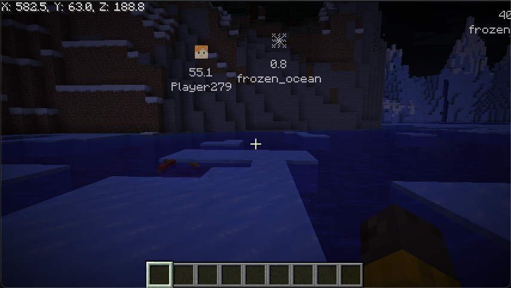

# Minecraft Coordinates Mod

Minecraft Coordinates Mod is a Fabric mod that allows you to record your in-game coordinates easily and display them on your screen. It also shows the positions of players in the world, making it easier to know where everyone is.

## Features

- **Save Coordinates:** Record your current position with a short description and an icon.
- **HUD Display:** Your current coordinates and the positions of other players are shown on your screen. *Note: To display other players' positions on the HUD, you must install this mod on the server as well.*
- **Coordinate List:** Easily view and manage your saved coordinates.

## Development Background

I created this mod to make playing Minecraft with my son even more fun!

In Survival Mode, a bunch of different monsters can appear, which can be scary for a kid. But with this mod, my son can instantly see where I am, and if anything happens, I can rush right over to help him.

## Installation

1. Install [Fabric Mod Loader](https://fabricmc.net/use/).
2. Place the mod JAR file into your Minecraft mods folder.
3. Launch Minecraft using the Fabric profile.

## Usage

- Press **G** to save your current position.
- Press **B** to open the coordinates list screen.
- Change settings via the mod's settings screen.
- The HUD will display real-time coordinate data and notifications as you play.

## License

This project (the mod itself) is licensed under the MIT License. See the [LICENSE](LICENSE) file for details.

This mod uses third-party libraries, including Fabric API, which is licensed under the Apache License 2.0.